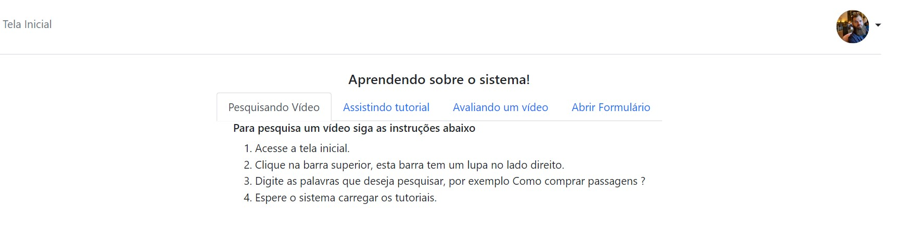

# Programação de Funcionalidades

1) Tela Home:

2) Tela logar:

3) Tela cadastro:

4) Tela Onboarding:

5) Tela vídeos

6) Tela vídeo

7) Feedback:

8) Gerenciar vídeos:

9) Tela de Perguntas Frequentes (SAC):

10) Chat:

11) Gerenciar Usuarios 

12) Fale Conosco

13) Formulário

14) Histórico

