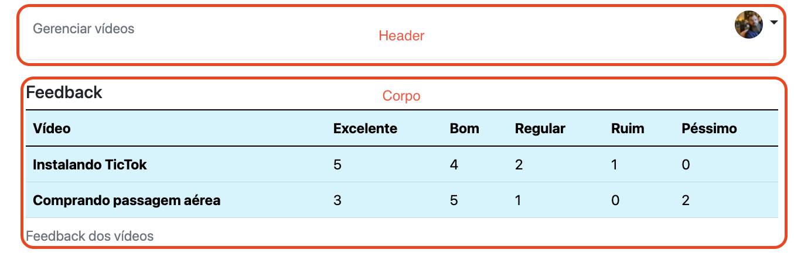

# Template padrão do site

### HTML
O html esta contido na pasta paginas.

### CSS
Para definir a folha de estilo utilizou-se o framework bootstrap v5.1. 
O método de instalação foi baixar os pacotes e copiar os arquivos do bootstrap dentro da pasta assets.

### Responsividade
Para atender o requisito de responsividade foi utilazado as classes do Bootstrap e a estratégia adotada foi
de layout fluído (flexbox) e de 12 colunas do framework css.

### Iconografia
O projeto utilza ícones da própria biblioteca do Bootstrap.