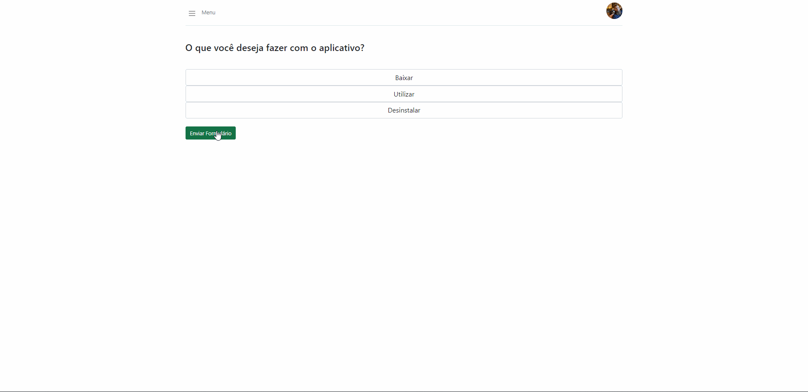

# Plano de Testes de Software

Id | Página |Requisito Funcional| Funcionalidade | Cenário de Teste|
---| ------ | ----------------- | -------------- | ----------------|
001| Vídeos | x                 | Exibir os vídeos cadastrados | Ao navegar para a tela de vídeos, o sistema deve carregar todos os vídeos cadastrados, caso não tenha nenhum vídeo deve mostrar a mensagem "Nenhum vídeo encontrado".
002| Vídeos | RF-003 |Pesquisa de Tutoriais por Assunto | Pré requisito, existir vídeo cadastrado. Após acessar a página de vídeos e o sistema mostrar os vídeos em tela, o usuário deverá clicar  na barra de pesquisa no topo da tela, digitar o termo a ser pesquisado  e o sistema deverá filtrar os vídeos baseado nos termos informados.
003| Vídeos | x |Navegar para vídeo selecionado | Pré requisito, existir vídeo cadastrado. Após acessar a página de vídeos e o sistema mostrar os vídeos em tela, o usuário deverá clicar em um dos vídeos e o sistema deverá navegar para a tela do vídeo selecionado.
004| Gerenciar Vídeos | x  | Tela Inicial Gerenciar Vídeos |Ao acessar a página de Gerenciar vídeos, a mesma deve mostrar todos os vídeos previamente inseridos, caso existam.
005| Gerenciar Vídeos | RF-002 | Inserir novo vídeo |Ao clicar no botão novo vídeo, o sistema deve abrir um modal onde o administrador deverá preencher os campos de id, título, descrição e link do vídeo. Após está ação, o vídeo será inserido na página.
006| Gerenciar Vídeos | x |Editar um vídeo | Ao clicar no botão de editar, o sistema abre um modal carregando os dados do vídeo previamente cadastrado e com isso, é possível editar os campos título, descrição e link do vídeo. O id do produto fica indisponível para edição.
007| Gerenciar Vídeos | x |Deletar um vídeo | Ao clicar no botão de deletar, o sistema abre um modal solicitando a confirmação da exclusão do vídeo. Ao clicar em “Sim”, o vídeo é deletado.
008| Formulário | RF-012 | Resposta a Perguntas do Formulário | O usuário irá responder as perguntas sobre seu problema, que farão que ele seja redirecionado para um vídeo de solução 
009| Formulário | X | Redirecionamento de Vídeo | O redirecionamento será de acordo com as questões respondidas, e funcionará de acordo com o banco de dado de vídeos disponibilizado
010| Gerenciar Usuários|RF-009| Editar Cliente|Ao clicar em editar será redirecionado um modal, onde o administrador podera editar as informações cadastradas do cliente, como "nome"  ou troca de "email". (todas as informações devem ser enviadas pelo "FaleConosco" para alterações)|
011|Gerenciar Usuários|x| Excluir Cliente|Ao clicar em excluir sera redirecionado um modal, onde o administrador podera excluir o cliente do sistema, em caso o cliente se abdicar do IdosoTech. (todas as informações devem ser enviadas pelo "FaleConosco" para alterações)|
012|Gerenciar Usuários|x|Cadastrar Cliente|Ao clicar em Cadastrar Cliente sera redirecionado um modal para um novo cadastro "manual" onde o administrardor irá realizar o cadastro, para auxiliar o cliente .(todas as informações devem ser enviadas pelo "FaleConosco" para alterações)|

-------------

# Registro de Testes de Software

Id do Teste | Resultado | Vídeo
---| ------ | ---------- 
001| O sistema carrega os vídeos do banco e quando não tem vídeo mostra mensage. | [NenhumVideoEncontrado](registro-de-testes/NenhumVideoEncontrado.gif)
002| O sistema filtra os vídeos baseado nos termos informados. | [PesquisarVideos](https://user-images.githubusercontent.com/91692537/176893585-fa179005-d747-48b0-bfc4-94372e6dee5f.gif)
003| Ao clicar no vídeo o sistema navega para a tela do vídeo selecionado. | [PesquisaVideoSelecionado](https://user-images.githubusercontent.com/91692537/176893712-dd3c8e16-2f10-4915-8a1e-8b318ad250e8.gif)
004| O sistema carrega os vídeos do banco de dados. | [TelaGerenciarVideos](https://user-images.githubusercontent.com/91692537/176716229-5b9d0e50-448b-48c6-9be4-b0a023864abb.png)
005| O sistema insere um novo vídeo. | [Inserir](https://user-images.githubusercontent.com/91692537/176732107-bddcb857-57f4-41f4-bd1b-3fdf2f7e8c85.gif)
006| Ao clicar no vídeo o sistema navega para a tela do vídeo selecionado. | [Editar](https://user-images.githubusercontent.com/91692537/176732819-43e74f75-3ae9-44e4-bb0b-eb59cc3fecf9.gif)
007| Ao clicar no vídeo o sistema exclui o vídeo selecionado. | [Deletar](https://user-images.githubusercontent.com/91692537/176733069-fb5e26f9-1a93-4f57-add5-712229b7e202.gif)
008| O formulário irá apresentar as perguntas sobre o seu problema | [PerguntasFormulario](registro-de-testes/ResponderPerguntas.gif)
009| Ao final do formulário, será apresentado o vídeo de solução | [VideoRedirecionado](registro-de-testes/VideoRedirecionado.gif)
010|O administrador podera editar as informações cadastradas do cliente| [Editar](https://user-images.githubusercontent.com/102393486/176815604-928da45f-1e94-4b37-8b54-c106c6730c13.gif)
011|O administrador podera Excluir as informações cadastradas do cliente| [Excluir](https://user-images.githubusercontent.com/102393486/176815250-88b25355-2a7a-4bf6-9f92-90ce1d1b2ecc.gif)
012|O administrador podera cadastrar as informações do Cliente| [Cadastrar Cliente](https://user-images.githubusercontent.com/102393486/176815207-cd6089c8-3646-48c0-b2fc-9e964fa3affe.gif)

# Registro de testes 

## ID 001 Nenhum vídeo encontrado

## ID 002 Pesquisa Vídeo

## ID 003 Pesquisa Vídeo Selecionado

## ID 004 Gerenciar Vídeos

## ID 005 Inserir Vídeo

## ID 006 Editar Vídeo

## ID 007 Deletar Vídeo

## ID 008 Resposta a Perguntas do Formulário

## ID 009 Redirecionamento a Vídeo de Solução

## ID 010 Editar Cliente

## ID 011 Excluir Cliente

## ID 012 Cadastrar Cliente

