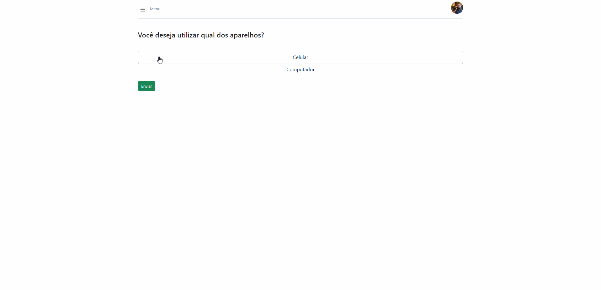

# Plano de Testes de Software

Id | Página |Requisito Funcional| Funcionalidade | Cenário de Teste|
---| ------ | ----------------- | -------------- | ----------------|
001| Vídeos | x                 | Exibir os vídeos cadastrados | Ao navegar para a tela de vídeos, o sistema deve carregar todos os vídeos cadastrados, caso não tenha nenhum vídeo deve mostrar a mensagem "Nenhum vídeo encontrado".
002| Vídeos | RF-003 |Pesquisa de Tutoriais por Assunto | Pré requisito, existir vídeo cadastrado. Após acessar a página de vídeos e o sistema mostrar os vídeos em tela, o usuário deverá clicar  na barra de pesquisa no topo da tela, digitar o termo a ser pesquisado  e o sistema deverá filtrar os vídeos baseado nos termos informados.
003| Vídeos | x |Navegar para vídeo selecionado | Pré requisito, existir vídeo cadastrado. Após acessar a página de vídeos e o sistema mostrar os vídeos em tela, o usuário deverá clicar em um dos vídeos e o sistema deverá navegar para a tela do vídeo selecionado.
004| Gerenciar Vídeos | x  | Tela Inicial Gerenciar Vídeos |Ao acessar a página de Gerenciar vídeos, a mesma deve mostrar todos os vídeos previamente inseridos, caso existam.
005| Gerenciar Vídeos | RF-002 | Inserir novo vídeo |Ao clicar no botão novo vídeo, o sistema deve abrir um modal onde o administrador deverá preencher os campos de id, título, descrição e link do vídeo. Após está ação, o vídeo será inserido na página.
006| Gerenciar Vídeos | x |Editar um vídeo | Ao clicar no botão de editar, o sistema abre um modal carregando os dados do vídeo previamente cadastrado e com isso, é possível editar os campos título, descrição e link do vídeo. O id do produto fica indisponível para edição.
007| Gerenciar Vídeos | x |Deletar um vídeo | Ao clicar no botão de deletar, o sistema abre um modal solicitando a confirmação da exclusão do vídeo. Ao clicar em “Sim”, o vídeo é deletado.
008| Formulário | RF-012 | Resposta a Perguntas do Formulário | O usuário irá responder as perguntas sobre seu problema, que farão que ele seja redirecionado para um vídeo de solução 
009| Formulário | X | Redirecionamento de Vídeo | O redirecionamento será de acordo com as questões respondidas, e funcionará de acordo com o banco de dado de vídeos disponibilizado
010| Gerenciar Usuários|RF-009| Editar|Ao cliclar em editar sera redirecionado um modal, onde o administrador podera editar as informações cadastradas do cliente como "nome" ,"senha" ou troca de "email". (todas as informações devem ser enviadas pelo "FaleConosco" para alterações)|
011|Gerenciar Usuários|x| Excluir|Ao cliclar em excluir sera redirecionado um modal, onde o administrador podera excluir o cliente do sistema em caso o cliente abdicar do IdosoTech. (todas as informações devem ser enviadas pelo "FaleConosco" para alterações)|
012|Gerenciar Usuários|x|Cadastrar Cliente|Ao cliclar em Cadastrar Cliente sera redirecionado um modal para um novo cadastro "manual" onde o administrardor irá realizar o cadastro, para auxiliar o cliente .(todas as informações devem ser enviadas pelo "FaleConosco" para alterações)|

-------------

# Registro de Testes de Software

Id do Teste | Resultado | Vídeo
---| ------ | ---------- 
001| O sistema carrega os vídeos do banco e quando não tem vídeo mostra mensage. | [NenhumVideoEncontrado](registro-de-testes/NenhumVideoEncontrado.gif)
002| O sistema filtra os vídeos baseado nos termos informados. | [PesquisarVideo](registro-de-testes/pesquisarVideo.gif)
003| Ao clicar no vídeo o sistema navega para a tela do vídeo selecionado. | [PesquisarVideo](registro-de-testes/pesquisarVideo.gif)
004| O sistema carrega os vídeos do banco de dados. | [TelaInicialGerenciarVideos](https://user-images.githubusercontent.com/91692537/173960460-99a9d18b-9617-4ff7-bd5d-4ca4723e2550.png)
005| O sistema insere um novo vídeo. | [InserirVideo](registro-de-testes/InserirVideo.gif)
006| Ao clicar no vídeo o sistema navega para a tela do vídeo selecionado. | [EditarVideo](registro-de-testes/EditarVideo.gif)
007| Ao clicar no vídeo o sistema exclui o vídeo selecionado. | [DeletarVideo](registro-de-testes/DeletarVideo.gif)
008| O formulário irá apresentar as perguntas sobre o seu problema | [PerguntasFormulario](registro-de-testes/ResponderPerguntas.gif)
009| Ao final do formulário, será apresentado o vídeo de solução | [VideoRedirecionado](registro-de-testes/VideoRedirecionado.gif)
010|O administrador podera editar as informações cadastradas do cliente| 

# Registro de testes 

## ID 001, 002 e 003 Nenhum vídeo encontrado e Pesquisar Vídeos.

## ID 004 Gerenciar Vídeos

## ID 005 Inserir Vídeo

## ID 006 Editar Vídeo

## ID 007 Deletar Vídeo

## ID 008 Resposta a Perguntas do Formulário

## ID 009 Redirecionamento a Vídeo de Solução

